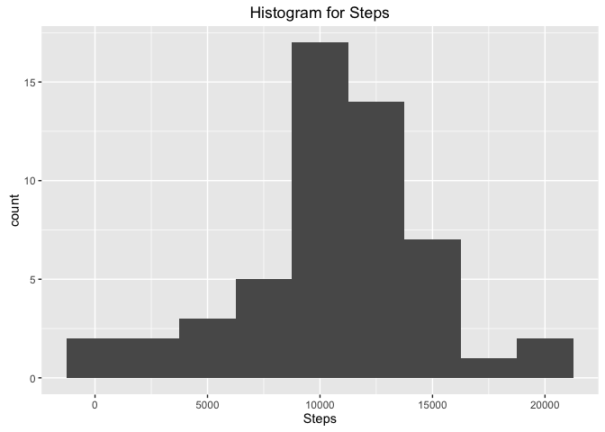
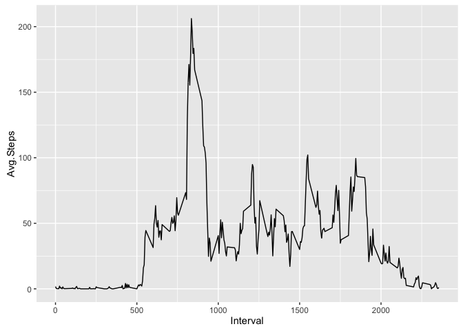
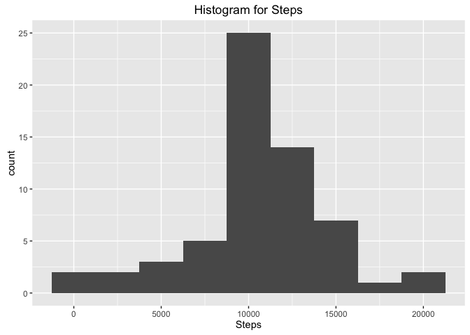
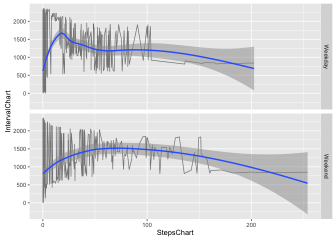

# Reproducible Research: Peer Assessment 1


## Loading and preprocessing the data

Read CSV from file.

```r
setwd('/Javier/Coursera/Reproducible_Research/week_2/Assignment_1_Send/RepData_PeerAssessment1')
dt <- read.csv('activity.csv', colClasses = c("numeric", "Date", "numeric"))
```

Remove NA's for further processing.

```r
dtClean <- na.omit(dt)
```

## What is mean total number of steps taken per day?

Get the aggregated data per day.


```r
dtPerDay <- aggregate(dtClean$steps, by=list(dtClean$date), FUN="sum")
# Assign correct name for the columns so it can be accesed later on.
colnames(dtPerDay) <- c("Date", "Steps")
```

The histogram presents the daily steps distribution. It has a bigger concentration between 10,000 and 15,000.


```r
library(ggplot2)

qplot(dtPerDay$Steps, geom="histogram",
      main = "Histogram for Steps",
      xlab = "Steps",
      binwidth = 2500)
```



Define a function that calculates Mean and Median from a data frame. (later on it will be used again)


```r
meanAndMedianGenerator <- function(dataFrameT) {
    # Find totals per day.
    dataPerDayT <- aggregate(as.numeric(as.character(dataFrameT$steps)),
                                by=list(as.numeric(as.Date(dataFrameT$date))),
                                FUN=sum
                                )
    colnames(dataPerDayT) = c("date", "steps")
    # Calculate mean and median, store it at a data frame.
    res <- data.frame('Mean'= mean(dataPerDayT$steps),
                      'Median'= median(dataPerDayT$steps)
            )
    return(res)
}
```
    
Through the last function, median and mean can be calculated:


```r
stepsTakenPerDay <- meanAndMedianGenerator(dtClean)
```

*Total value for mean:*


```r
stepsTakenPerDay$Mean[1]
```

```
## [1] 10766.19
```

*Total value for median:*


```r
stepsTakenPerDay$Median[1]
```

```
## [1] 10765
```

## What is the average daily activity pattern?

The plot shows the Avg Steps per Interval through the day.


```r
dtPerDayPerInterval <- aggregate(dtClean$steps, by=list(dtClean$interval), FUN=mean)
colnames(dtPerDayPerInterval) <- c("Interval", "Avg.Steps")

qplot(dtPerDay$Steps, geom="histogram",
      main = "Histogram for Steps",
      xlab = "Steps",
      binwidth = 2500)
```


The interval number *835* has the maximum average number of steps. The interval has *206* steps. The following code explains how to get the former result.


```r
# Data is processed to get an average number of steps per interval.
dtPerDayPerInterval <- aggregate(dtClean$steps, by=list(dtClean$interval), FUN=mean)
colnames(dtPerDayPerInterval) <- c("Interval", "Avg.Steps")
```

The following plot shows the average number of steps per interval.


```r
ggplot(dtPerDayPerInterval,
      aes(x = Interval, y = Avg.Steps)) + geom_line()
```



## Imputing missing values

The following code helps us to know the total amount of NAs at the origintal data loaded.


```r
dtCountNA <- sum(is.na(dt$steps))
```

The total NAs count is:


```r
print(dtCountNA)
```

```
## [1] 2304
```

###Removing and filling NAs
In order to substitute NAs by data that can be processed, the whole data frame needs to be traversed in search of the missing values.

First a function is defined, where the current value is tested. In case a NA is found, it is replaced by the mean value at the current interval. The full row is returned so it can be appended to the new result.


```r
testFuncion <- function(x) {
    if(is.na(x['steps'])){
        x['steps'] <- dtPerDayPerInterval[dtPerDayPerInterval$Interval==as.numeric(as.character(x['interval'])), 2] 
    } 
    x
}
```

A new data set is created where the NAs are replaced for data which can be processed. Function apply is used to traverse the data frame. The matrix got is transposed to create the correct data frame format.


```r
dtReplacedNA <- as.data.frame(t(apply(X=dt, MAR=1, FUN=testFuncion)))
```

The following histogram can be compared with previous one (i.e. data without NAs), showing similar results at first sight.


```r
dtPerDayNA <- aggregate(as.numeric(as.character(dtReplacedNA$steps)),
                        by=list(as.Date(as.character(dtReplacedNA$date))),
                        FUN="sum")
colnames(dtPerDayNA) <- c("Date", "steps")

qplot(dtPerDayNA$steps, geom="histogram",
      main = "Histogram for Steps",
      xlab = "Steps",
      binwidth = 2500)
```



Although results show similarity, median is diferent from previous analysis (i.e. data without NAs). Applying the previous function to calculate mean and median we can compare it.


```r
stepsTakenPerDayWithNA <- meanAndMedianGenerator(dtReplacedNA)
```


*Total value for mean with NAs replaced:*


```r
stepsTakenPerDayWithNA$Mean[1]
```

```
## [1] 10766.19
```

Mean is the same as previous results

*Total value for median with NAs replaced:*


```r
stepsTakenPerDayWithNA$Median[1]
```

```
## [1] 10766.19
```

There is a difference in the Median of 1 compared with previous results. This shows that results may vary if NAs are not removed.


## Are there differences in activity patterns between weekdays and weekends?

In order to compare patterns from weekends to weekdays, a new column must be added to the original data frame. (The data frame to be used will be the one with NAs replaced with data that can be processed)

First each row must be evaluated to find if the date refers to a weekday or weekend. With this evaluation the new column can be created and appended to the original data frame.


```r
# Dates are transformed into a number from the day of the week it corrsponds to.
weekDayNum <- as.POSIXlt(as.character(dtReplacedNA$date), format="%Y-%m-%d")$wday < 5

# Functions which evaluates the day number and returns if it correspond to a weekday or weekend.
defineWeekend <- function(x) {
    if(x) {
        return('Weekday')
    } else {
        return('Weekend')
    }
}

# Each row is evaluated and the correct label is assigned.
weekDayCol <- as.character(lapply(weekDayNum, defineWeekend))

#Append column to original data.
dtReplacedNAWithWeekday <- cbind(dtReplacedNA, weekDayCol)

# Transform data frame to correct data types.
dtReplacedNAWithWeekday$date <- as.Date(as.character(dtReplacedNAWithWeekday$date))
dtReplacedNAWithWeekday$steps <- as.numeric(as.character(dtReplacedNAWithWeekday$steps))
dtReplacedNAWithWeekday$interval <- as.numeric(as.character(dtReplacedNAWithWeekday$interval))
```

A plot can be generated in order to compare behaviours from weekdays to weekends.


```r
# Aggregate steps by interval and type of day (i.e. weekday or weekend)
dtPerDayPerIntervalDays <- aggregate(dtReplacedNAWithWeekday$steps,
                                     by=list(dtReplacedNAWithWeekday$weekDayCol,
                                             dtReplacedNAWithWeekday$interval),
                                            FUN=mean
                                     )
colnames(dtPerDayPerIntervalDays) = c("DayCol", "IntervalChart", "StepsChart")

# Generate Plot to compare day types.

qplot(StepsChart,
      IntervalChart,
      data = dtPerDayPerIntervalDays,
      facets = DayCol ~ .,
      geom = c('line', 'smooth'),
      alpha=I(.5)
      )
```



###Conclusion
It appears that over weekends, steps increases from 500 to 2,000. The patter is similar with higher numbers over the weekend. Number of steps are similar over the interval edges (e.g. below 500 and over 2,000).
